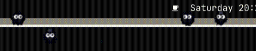

# Susuwatari (ススワタリ)

> **Animated *Spirited Away* Soot Sprites for Omarchy & Wayland / Hyprland**

A delightful, ultra-lightweight desktop pet plugin for **Omarchy**. Features an animated Waybar toggle widget and mischievous soot sprites that live directly on your active window frames and occasionally sneak down to pull off a solo mouse cursor heist!




> *"I really love the Susuwatari in the movie 'Spirited Away', and I had this idea: why not have them as little desktop pets on our machine and bring their cute, playful behavior to life just for fun and chill?"*

---

## ✨ Features

- 🏮 **Active Window Frame Pets**: Soot sprites balance and scurry (`トコトコ`) directly along the top frame of your focused application window.
- 🖱️ **Solo Mouse Heist**: When your mouse is left untouched (>7s), a solitary soot sprite occasionally sneaks down from the window, playfully lifts your cursor with raised hands, and drags it across your screen before letting go with a sparkle (`✨`)!
- 💨 **Hover Startle & Scatter**: Move your mouse close to any sprite on the window bar to see them jump (`ぴょん！`) with wide shock eyes (`O O`) and scamper away.
- 💨 **Fast-Swipe Poof**: Swiping your cursor rapidly through a soot sprite temporarily poofs it into a cloud of soot particles, which quickly reforms.
- 👥 **Social Bumping**: When two sprites walk into each other on the window frame, they softly bump and bounce apart with curious glances.
- 🪨 **Boiler Room Coal**: True to Kamaji's boiler room in *Spirited Away*, some sprites carry tiny lumps of coal (`炭`).
- ⚡ **Ultra-Lightweight & Efficient**:
  - **Memory**: Only **~500 KB private RAM** (pure native Wayland C client, no GTK or GNOME runtime bloat).
  - **Binary**: Just **46 KB** (compiled from source).
  - **CPU**: **<0.2%** at 50 FPS.
- 🎛️ **Waybar Widget Controller**: An animated soot sprite on your Waybar that patters faster under CPU load and toggles the desktop window pets ON/OFF with a single click.

---

## 📦 Installation

### One-Step Install (Omarchy Plugin Manager):

```sh
omarchy plugin add https://github.com/JoeJoeflyn/omasusuwatari.git --enable
```

### Manual Installation (From Source):

```sh
git clone https://github.com/JoeJoeflyn/omasusuwatari.git ~/.config/omarchy/plugins/omasusuwatari
cd ~/.config/omarchy/plugins/omasusuwatari
./setup.sh
```

---

## 🎮 Controls & Interactions

| Action | Result |
| :--- | :--- |
| **Click Waybar Icon** | Toggles desktop window pets **ON / OFF** (with a happy jump). |
| **Hover on Window Bar** | Startles the soot sprites into a rapid scatter. |
| **Swipe Fast across Sprite** | Startles sprite into a harmless cloud of soot dust (`poof!`). |
| **Leave Mouse Still (~7s)** | Occasionally triggers the solo mouse heist! |
| **Move Mouse during Heist** | Startles the sprite, making it drop your cursor and scurry home. |

---

## ⚙️ Configuration & Bar Position

To move the Waybar widget to a different section or slot:

```sh
# Move to right section
omarchy bar move omasusuwatari --section right

# Or edit ~/.config/omarchy/shell.json directly under "bar.layout"
```

---

## 🛠️ Tech Stack & Architecture

- **Bar Widget**: Native Qt6 / QML component running inside `quickshell`.
- **Desktop Window Overlay**: Pure C standalone Wayland Layer-Shell client (`libwayland-client` + `libcairo` + POSIX Shared Memory) connecting to Hyprland's IPC socket for active window tracking and cursor interactions.
- **Self-Contained**: Builds locally from `src/main.c` directly into the plugin directory with zero global system modification.

### Build Dependencies (for building from source):
- `gcc` / `clang`
- `wayland-client`
- `cairo`
- `pkg-config`

---

## 🗑️ Uninstallation

```sh
omarchy plugin remove omasusuwatari --yes
```

---

## 📄 License

MIT © [JoeJoeflyn](https://github.com/JoeJoeflyn)
Inspired by Studio Ghibli's *Spirited Away* (千と千尋の神隠し).
